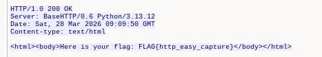
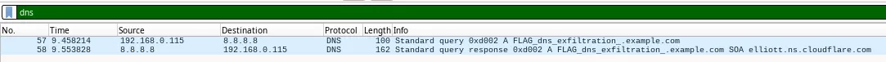
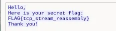
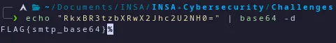
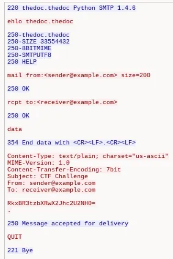
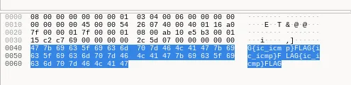

# Challenge Write-Up: Wireshark Packet Analysis

**Date:** March 28, 2026
**Flags Found:** 5/5

---

## Tools Used

- **Wireshark** — packet capture and analysis
- **terminal** — Base64 decoding

---

## Challenge 1 — HTTP Traffic

**Flag:** `FLAG{http_easy_capture}`
**Hint:** *"Sometimes secrets travel unencrypted. Inspect the messages your browser asks for."*

### Method
1. Opened `challenge_1_traffic.pcap` in Wireshark
2. Applied filter: `http`
3. Right-clicked a packet → Follow → HTTP Stream
4. Flag found in plain HTML response body

### Why it worked
HTTP is unencrypted — everything including credentials,
cookies, and page content is visible in plain text.
This is why HTTPS exists.



---

## Challenge 2 — DNS Exfiltration

**Flag:** `FLAG{dns_exfiltration}`
**Hint:** *"Even small questions can carry hidden messages. Check what your system is asking the internet."*

### Method
1. Opened `challenge_2_traffic.pcap` in Wireshark
2. Applied filter: `dns`
3. Found suspicious DNS query to:
   `FLAG_dns_exfiltration_.example.com`
4. Flag was encoded in the subdomain of the DNS query

### Why it worked
DNS queries are rarely blocked by firewalls.
Attackers use DNS to exfiltrate data by encoding
it inside domain name queries — the data  leaves
the network disguised as normal DNS traffic.



---

## Challenge 3 — TCP Stream Reassembly

**Flag:** `FLAG{tcp_stream_reassembly}`
**Hint:** *"The answer might be broken into pieces across multiple packets. Reassemble to see the whole picture."*

### Method
1. Opened `challenge_3_traffic.pcap` in Wireshark
2. Applied filter: `tcp`
3. Right-clicked a packet → Follow → TCP Stream
4. Wireshark reassembled all packets into full message:

```
Hello,
Here is your secret flag:
FLAG{tcp_stream_reassembly}
Thank you!
```

### Why it worked
TCP data is split across multiple packets.
Following the stream tells Wireshark to
reassemble them in order to show the
complete conversation.



---

## Challenge 4 — SMTP Base64 Encoded

**Flag:** `FLAG{smtp_base64}`
**Hint:** *"Some messages arrive encoded. The transport might reveal patterns in the body rather than the headers."*

### Method
1. Opened `challenge_4_traffic.pcap` in Wireshark
2. Applied filter: `smtp`
3. Found two email streams:
   - First stream: body said "Wrong flag, try again!"
   - Second stream: body contained Base64 string

```
RkxBR3tzbXRwX2Jhc2U2NUh0=
```

4. Decoded in terminal:

```bash
echo "RkxBR3tzbXRwX2Jhc2U2NUh0=" | base64 -d
FLAG{smtp_base64}
```

### Why it worked
Attackers encode data to avoid simple keyword
detection. Base64 doesn't encrypt — it just
encodes. Anyone who spots it can decode it.




---

## Challenge 5 — ICMP Payload

**Flag:** `FLAG{ic_icmp}`
**Hint:** *"Even simple pings can carry secrets inside them. Don't just look at the summary — peek at the payload."*

### Method
1. Opened `challenge_5_traffic.pcap` in Wireshark
2. Applied filter: `icmp`
3. Clicked on a packet
4. Looked at the raw payload in the bottom pane
5. Flag visible directly in the hex/ASCII view

### Why it worked
ICMP ping packets have a data payload field.
By default ping fills it with random bytes,
but attackers can replace it with any data.
This is called ICMP tunneling — used to
smuggle data past firewalls that only block TCP/UDP.



---

## Summary

| # | Flag | Protocol | Method |
|---|------|----------|--------|
| 1 | `FLAG{http_easy_capture}` | HTTP | Follow HTTP stream |
| 2 | `FLAG{dns_exfiltration}` | DNS | Filter DNS, read domain |
| 3 | `FLAG{tcp_stream_reassembly}` | TCP | Follow TCP stream |
| 4 | `FLAG{smtp_base64}` | SMTP | Follow SMTP stream + base64 -d |
| 5 | `FLAG{ic_icmp}` | ICMP | Inspect ICMP payload |

---

## Lessons Learned

- **HTTP** is unencrypted — never send sensitive data over HTTP
- **DNS** can be used to exfiltrate data — monitor unusual domain queries
- **TCP streams** must be reassembled to read full conversations
- **Base64** is encoding not encryption — easy to decode
- **ICMP** payloads can carry hidden data — don't ignore ping traffic
- Wireshark filters (`http`, `dns`, `tcp`, `smtp`, `icmp`) are essential
  for isolating relevant traffic quickly
